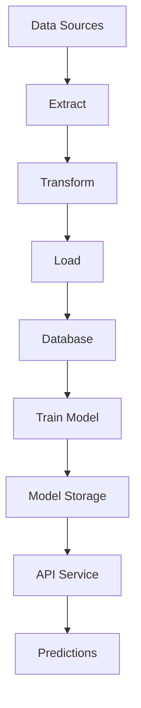

# End-to-End Data Pipeline with ETL and Machine Learning

## Overview
This project implements a comprehensive data pipeline that:
1. Extracts data from multiple sources (CSV files, APIs)
2. Transforms and cleans the data
3. Loads processed data into a PostgreSQL database
4. Trains machine learning models for predictive analytics
5. Serves predictions through a REST API
6. Provides monitoring and logging capabilities

## Features
- **ETL Pipeline**: Modular and extensible data processing pipeline
- **Machine Learning**: Model training and persistence
- **REST API**: FastAPI-based service for predictions
- **Logging**: Comprehensive logging for monitoring and debugging
- **Configuration**: Environment-based configuration management

## Architecture


## Installation
1. Clone the repository:
```bash
git clone https://github.com/Darwee4/end-to-end-data-pipeline.git
cd end-to-end-data-pipeline
```

2. Install dependencies:
```bash
pip install -r requirements.txt
```

3. Set up environment variables:
```bash
cp .env.example .env
```

4. Run the pipeline:
```bash
python -m etl.run_pipeline
```

## Usage
- Run ETL pipeline: `python -m etl.run_pipeline`
- Train model: `python -m ml.train`
- Start API: `uvicorn api.main:app --reload`

## Contributing
Contributions are welcome! Please follow these steps:
1. Fork the repository
2. Create a feature branch
3. Submit a pull request

## License
MIT License - See LICENSE for details
